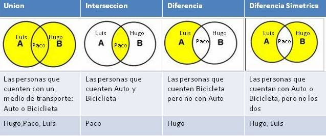
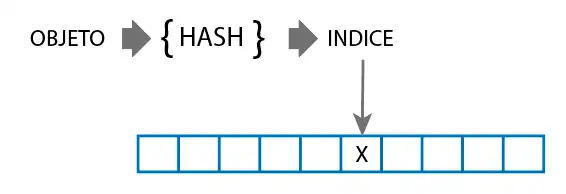

# Ejercicios de Conjuntos: Conjuntos en Pascal y Conjuntos a través de Listas y Arrays

### Información del Proyecto

| Descripción   | Detalles                           |
|---------------|------------------------------------|
| Profesores    | Sergio Cavero y Salvador Sanchez   |
| Asignatura    | Estructuras de Datos               |
| Universidad   | Universidad Rey Juan Carlos        |
| Licencia      | CC BY-NC-SA 4.0                    |

<!-- TOC -->

- [Ejercicios de Conjuntos: Conjuntos en Pascal y Conjuntos a través de Listas y Arrays](#ejercicios-de-conjuntos-conjuntos-en-pascal-y-conjuntos-a-trav%C3%A9s-de-listas-y-arrays)
        - [Información del Proyecto](#informaci%C3%B3n-del-proyecto)
- [¿Cómo enfrentarse a los ejercicios?](#%C2%BFc%C3%B3mo-enfrentarse-a-los-ejercicios)
- [Ejercicio 1: Introducción a Conjuntos en Pascal](#ejercicio-1-introducci%C3%B3n-a-conjuntos-en-pascal)
- [Ejercicio 2: Operaciones básicas con conjuntos](#ejercicio-2-operaciones-b%C3%A1sicas-con-conjuntos)
- [Ejercicio 3: Parte 1: Conjuntos a través de Listas](#ejercicio-3-parte-1-conjuntos-a-trav%C3%A9s-de-listas)
- [Ejercicio 3: Parte 2: Bolsas a través de Listas](#ejercicio-3-parte-2-bolsas-a-trav%C3%A9s-de-listas)
- [Ejercicio 4: Introducción a Conjuntos a través de Arrays y con función Hash](#ejercicio-4-introducci%C3%B3n-a-conjuntos-a-trav%C3%A9s-de-arrays-y-con-funci%C3%B3n-hash)
- [Ejercicio 5: Creando un HashMap: Clave - Valor Opcional](#ejercicio-5-creando-un-hashmap-clave---valor-opcional)
- [Ejercicio 6: Aplicación Práctica de Conjuntos - El bingo](#ejercicio-6-aplicaci%C3%B3n-pr%C3%A1ctica-de-conjuntos---el-bingo)
- [Otros ejercicios propuestos](#otros-ejercicios-propuestos)
    - [Multiset](#multiset)
    - [Añade nuevas funcionalidades a uMiConjunto.pas](#a%C3%B1ade-nuevas-funcionalidades-a-umiconjuntopas)
    - [Añade nuevas funcionalidades a uHashSet.pas y uHashMap.pas](#a%C3%B1ade-nuevas-funcionalidades-a-uhashsetpas-y-uhashmappas)
    - [Implementación de conjuntos genéricos](#implementaci%C3%B3n-de-conjuntos-gen%C3%A9ricos)

<!-- /TOC -->


# ¿Cómo enfrentarse a los ejercicios?

Antes de comenzar con cada uno de los ejercicios: 

1. Lee detenidamente el enunciado **completo**.
2. Identifica cuál es el objetivo del ejercicio:
    - Identificar el tipo de elementos que se almacenará en la cola: 
        - Ejemplos: enteros, caracteres, registros, etc.
        - Esto va a determinar la definición de los nodos de la cola (o el tipo de array en caso de no ser una cola implementada en memoria dinámica).
    - Extender o modificar funcionalidades de la cola:
        - Ejemplos: contar el número de elementos de la cola, verificar si un elemento está en la cola, eliminar un elemento, etc.
        - Generar nuevos procedimientos o funciones requerirá utilizar las operaciones principales.
        - Es decir, nuevamente deberemos **trabajar en la propia unidad** de la cola ya que estamos extendiendo su funcionalidad. Tendremos el "rol" de implementador de la unidad.
    - Utilizar la cola para resolver un problema específico:
        - Ejemplos: verificar si una expresión aritmética está balanceada, verificar si una palabra es palíndroma, utilizarla para representar un conjunto de elementos, etc.
        - En este caso, deberemos utilizar las operaciones básicas de la unidad de la cola para resolver el problema, no podemos modificar la definición de la cola.

    
2. Abre cada uno de los archivos proporcionados y estudia el código proporcionado.
3. Haz que el programa compile y ejecútalo aunque de primeras no haga todo lo que se pide.
4. Realiza los ejercicios de manera ordenada, comprobando que cada uno de ellos funciona correctamente antes de pasar al siguiente.


# Ejercicio 1: Introducción a Conjuntos en Pascal

En este ejercicio vamos a trabajar con conjuntos en Pascal. Un conjunto es una colección no ordenada de elementos no repetidos. Pascal ofrece, a diferencia de lo que ocurre con otras estructuras de datos tales como las pilas, colas, listas, etc., soporte para el concepto de conjunto mediante el tipo de dato `set`. Este soporte en Pascal está restringido a almacenar elementos de tipos ordinales y con un máximo de 256 valores posibles (ej. `char`, enumerado, subrango, etc.) y por tanto vamos a trabajar primero con el tipo `set` pero pronto optaremos por realizar nuestra propia implementación de un TAD Conjunto. 

Para comenzar, vamos a trabajar con conjuntos de enteros basándonos en el tipo `set` de Pascal, así que empieza por localizar los siguientes archivos:

- `conjuntos_ej1.pas`: Programa principal en el que deberás implementar las funciones y procedimientos necesarios para trabajar con conjuntos de enteros.
- `uListaEnlazadaSimple.pas`: Unidad que contiene la definición de una lista enlazada simple para almacenar enteros. Esta unidad ya está implementada y no deberás modificarla.

Localiza el archivo `conjuntos_ej1.pas` y dentro de él, encontrarás el procedimiento `procedure generar_lista_sin_duplicados(var list, aux: tListaSimple);`. Este procedimiento recibe dos listas. La primera lista contiene elementos duplicados. La segunda lista deberás inicializarla para que al final de la ejecución contenga los elementos de la primera lista sin duplicados y en orden ascendente. Usando conjuntos mediante la declaración de un `set`de Pascal, debes copiar los elementos de la primera lista a la segunda lista, eliminando los duplicados y ordenados de menor a mayor.

Aunque este ejercicio puede hacerse sin utilizar conjuntos, el objetivo es que practiques con ellos y veas cómo su uso puede facilitar la resolución de ciertos problemas.

Restricciones:
- No se puede utilizar la función `copy` para copiar la lista.
- No se puede utilizar la función `in_list` para comprobar si un elemento está en la lista.
- La complejidad de la solución debe ser O(n).
- No se pueden pasar los elementos a otras lista y usar la función `sort`.

Resultado esperado:

```
Ejercicio: Generar una lista con elementos sin duplicados y ordenada.
===========================================

Caso 1: 1 3 4 5 5 2 3  -> 1 2 3 4 5  bien.
Caso 2: 1 1  -> 1  bien.
```

# Ejercicio 2: Operaciones básicas con conjuntos

En este ejercicio vamos a seguir trabajando con el soporte para conjuntos que nos da el tipo `set`de Pascal. En particular, programaremos algunas de las operaciones básicas que se pueden realizar con conjuntos. 

Localiza el archivo `conjuntos_ej2.pas`, en el cual deberás implementar las siguientes funciones y procedimientos:
- `diferencia_simetrica_conjuntos`: Dados dos conjuntos de enteros A y B, la diferencia simétrica de A y B es el conjunto de elementos que están en A o en B, pero no en ambos. Por ejemplo, si A = [1, 2, 3] y B = [3, 4, 5], entonces la diferencia simétrica de A y B es [1, 2, 4, 5].
- `es_subconjunto`: Implementa una función que reciba dos conjuntos A y B y devuelva true si A es subconjunto de B, y false en caso contrario. Por ejemplo, si A = [1, 2] y B = [1, 2, 3], entonces A es subconjunto de B.
- `interseccion_conjuntos`: Implementa un procedimiento que reciba dos conjuntos A y B y devuelva un conjunto C con la intersección de ambos conjuntos. Por ejemplo, si A = [1, 2, 3] y B = [3, 4, 5], entonces la intersección de A y B es [3].
- `union_conjuntos`: Implementa un procedimiento que reciba dos conjuntos A y B y devuelva un conjunto C con la unión de ambos conjuntos. Por ejemplo, si A = [1, 2, 3] y B = [3, 4, 5], entonces la unión de A y B es [1, 2, 3, 4, 5].
- `diferencia_conjuntos`: Implementa un procedimiento que reciba dos conjuntos A y B y devuelva un conjunto C con la diferencia de ambos conjuntos. Por ejemplo, si A = [1, 2, 3] y B = [3, 4, 5], entonces la diferencia de A y B es [1, 2].

En la siguiente figura puedes ver un ejemplo de operaciones sobre conjuntos:


Restricciones:
- No puedes usar los operadores predefinidos en Pascal para operaciones entre conjuntos: <= (subconjunto), * (intersección), + (unión), - (diferencia), ni >< (diferencia simétrica).
  
Resultado esperado:

```
Ejercicio 2.1: Diferencia simétrica de conjuntos
Diferencia simétrica de A y B: TRUE
Diferencia simétrica de A y B: TRUE
Diferencia simétrica de A y B: TRUE
-----------------------------------------------
Ejercicio 2.2: Es subconjunto
A es subconjunto de B: TRUE
A es subconjunto de B: TRUE
A es subconjunto de B: TRUE
-----------------------------------------------
Ejercicio 2.3: Intersección de conjuntos
Intersección de A y B: TRUE
Intersección de A y B: TRUE
Intersección de A y B: TRUE
-----------------------------------------------
Ejercicio 2.4: Unión de conjuntos
Unión de A y B: TRUE
Unión de A y B: TRUE
Unión de A y B: TRUE
-----------------------------------------------
Ejercicio 2.5: Diferencia de conjuntos
Diferencia de A y B: TRUE
Diferencia de A y B: TRUE
Diferencia de A y B: TRUE
-----------------------------------------------
```

# Ejercicio 3: Parte 1: Conjuntos implementados internamente con Listas

En este ejercicio vamos a crear un ConjuntoEnteros cuyo almacenamiento interno va a ser una lista enlazada simple. Para ello, deberás localizar los tres siguientes ficheros: 

- `conjuntos_ej3.pas`: Programa principal que se utilizará para comprobar que has superado el ejercicio.
- `uListaEnlazadaSimple.pas`: Unidad que contiene la definición de una lista enlazada simple. Esta unidad ya está implementada y no deberás modificarla.
- `uMiConjunto.pas`: Unidad que deberás implementar. 

¡Atención! Tendras el rol de desarrollador de la unidad `uMiConjunto.pas` pero a la vez, el rol de usuario de la unidad `uListaEnlazadaSimple.pas`. Es decir, deberás utilizar la lista enlazada simple para implementar el conjunto.

Dentro de la unidad `uMiConjunto.pas` deberás implementar un TAD `ConjuntoEnteros` en Pascal utilizando los tipos y operaciones que ofrece el TAD Lista enlazada simple. Para ello, deberás implementar las siguientes funciones y procedimientos:

- `procedure initialize(var c: tConjunto)`: Inicializa el conjunto. Esta función deberá inicializar la lista enlazada simple.
- `procedure add(var c: tConjunto; x: integer)`: Añade un elemento al conjunto. Esta función deberá añadir un elemento a la lista enlazada simple si no está ya presente.
- `procedure remove(var c: tConjunto; x: integer)`: Elimina un elemento del conjunto. Esta función deberá eliminar un elemento de la lista enlazada simple si está presente.
- `function contains(c: tConjunto; x: integer): boolean`: Comprueba si un elemento está en el conjunto. Esta función deberá devolver `true` si el elemento está en la lista enlazada simple y `false` en caso contrario.
- `function is_empty(c: tConjunto): boolean`: Comprueba si el conjunto está vacío. Esta función deberá devolver `true` si la lista enlazada simple está vacía y `false` en caso contrario.
- `function size(c: tConjunto): integer;`: Devuelve el número de elementos del conjunto. Esta función deberá devolver el número de elementos de la lista enlazada simple.
- `function to_string(c: tConjunto): string`: Devuelve una cadena con los elementos del conjunto. Esta función deberá devolver una cadena con los elementos de la lista enlazada simple.
- `procedure clear(var c: tConjunto)`: Vacía el conjunto. Esta función deberá vaciar la lista enlazada simple.
- `procedure union(c1, c2: tConjunto; var c3: tConjunto)`: Realiza la unión de dos conjuntos. Esta función deberá devolver un nuevo conjunto con los elementos de los conjuntos `c1` y `c2`. Por ejemplo, si `c1` contiene los elementos `1, 2, 3` y `c2` contiene los elementos `3, 4, 5`, el conjunto `c3` deberá contener los elementos `1, 2, 3, 4, 5`.
- `procedure intersection(c1, c2: tConjunto; var c3: tConjunto)`: Realiza la intersección de dos conjuntos. Esta función deberá devolver un nuevo conjunto con los elementos comunes de los conjuntos `c1` y `c2`. Por ejemplo, si `c1` contiene los elementos `1, 2, 3` y `c2` contiene los elementos `3, 4, 5`, el conjunto `c3` deberá contener el elemento `3`.
- `procedure difference(c1, c2: tConjunto; var c3: tConjunto)`: Realiza la diferencia de dos conjuntos. Esta función deberá devolver un nuevo conjunto con los elementos que están en `c1` pero no en `c2`. Por ejemplo, si `c1` contiene los elementos `1, 2, 3` y `c2` contiene los elementos `3, 4, 5`, el conjunto `c3` deberá contener los elementos `1, 2`.

Resultado esperado:

```
                        Prueba           Resultado  Resultado Esperado   OK
---------------------------------------------------------------------------
                   initialize                  -1                  -1   Sí
             add (un elemento)                 10                  10   Sí
           add (dos elementos)              10 20               10 20   Sí
      add (elemento duplicado)              10 20               10 20   Sí
          remove (un elemento)                 20                  20   Sí
 remove (elemento inexistente)                 20                  20   Sí
     remove (último elemento)                                           Sí
contains (elemento existente)                  -1                  -1   Sí
contains (elemento inexistente)                 0                   0   Sí
    contains (conjunto vacío)                   0                   0   Sí
    is_empty (conjunto vacío)                  -1                  -1   Sí
 is_empty (conjunto no vacío)                   0                   0   Sí
        size (conjunto vacío)                   0                   0   Sí
           size (un elemento)                   1                   1   Sí
         size (dos elementos)                   2                   2   Sí
         size (con duplicado)                   2                   2   Sí
   to_string (conjunto vacío)                                           Sí
to_string (conjunto con elementos)       30 10 20            30 10 20   Sí
                         empty                                          Sí
          empty (is_empty_con)                 -1                  -1   Sí
 union (con elementos comunes)              1 2 3               1 2 3   Sí
 union (sin elementos comunes)            1 2 3 4             1 2 3 4   Sí
         union (ambos vacíos)                                           Sí
intersection (con elementos comunes)            2                   2   Sí
intersection (sin elementos comunes)                                    Sí
intersection (un elemento común)                1                   1   Sí
  intersection (ambos vacíos)                                           Sí
difference (con elementos comunes)              1                   1   Sí
difference (sin elementos comunes)            1 2                 1 2   Sí
difference (un elemento común)                                          Sí
    difference (ambos vacíos)                                           Sí
   difference (segundo vacío)                   1                   1   Sí
   difference (primero vacío)                                           Sí
```

# Ejercicio 3: Parte 2: Bolsas implementadas internamente con  Listas

A partir de la implementación del TAD ConjuntoEnteros mediante listas enlazadas simples, vamos a implementar un TAD `BolsaEnteros`. Recuerda que una bolsa es una colección desordenada de elementos en la que estos pueden repetirse.

Utilzia la unidad `uMiConjunto.pas` que has implementado en el ejercicio anterior y úsala como base para implementar un TAD `BolsaEnteros` en lugar de un conjunto. Para ello, deberás duplicarla y renombrarla como `uMiBolsa.pas`. 

Unicamente deberás implementar las 5 operaciones básicas: 
- Añadir un elemento (`add`)
- Eliminar un elemento (`remove`)
- Eliminar todas las ocurrencias de un elemento (`remove_all`)
- Multiplicidad de un elemento (`multiplicity`)
- Conocer el tamaño o número de elementos (`size`)
- Inicializar/crear (`initialize`)


# Ejercicio 4: Introducción a la implementación de Conjuntos mediante Tablas Hash (array + función Hash)

En este ejercicio vamos a implementar un conjunto que use como almacenamiento interno una tabla hash, la cual utiliza arrays y funciones hash. Para ello, deberás localizar los siguientes ficheros:

- `conjuntos_ej4$.pas`: Programa principal que se utilizará para comprobar que has superado el ejercicio. Necesitarás implementar algunas funciones y procedimientos en este archivo.
- `uHashSet.pas`: Unidad que deberás implementar parcialmente.

Como sabes, el principal problema que tiene un conjunto implementado internamente mediante listas -como el creado en el ejercicio anterior- es la eficiencia. El problema principal es que la operación para determinar si un elemento pertenece o no al conjunto es muy costosa en términos de tiempo, cuando resulta que... ¡es la operación más utilizada!. Esto es así porque en una implementación básica, determinar si un elemento está en la lista requerirá frecuentemente recorrer toda la lista.

Como la potencia de los conjuntos es justo su capacidad para determinar si un elemento está o no en el conjunto de forma muy eficiente, por lo general se utilizan arrays y funciones hash que permiten determinar la posición de un elemento en el conjunto de forma directa. Ten en cuenta que, de las estructuras de datos que conocemos, la más eficiente a la hora de determinar si algo existe es un array, en el que podemos acceder a cualquier posición en tiempo constante. Con esto en mente, vamos a implementar un conjunto a través de un array y una función hash.

Pero... ¿qué es una función hash? Una función hash es una función que transforma una clave de un cierto tipo y devuelve un número entero, el cual se utiliza para determinar la posición de dicha clave en el array. Por ejemplo, si tenemos un array de 10 elementos y la función hash devuelve un número entre 0 y 9, el valor que nos de la aplicación de la función hash a una cierta clave (por ejemplo 'HOLA') determinará la posición de la clave 'HOLA' en el array. En la siguiente imagen se muestra una representación gráfica de estos conceptos y funcionamiento. 



Ahora la pregunta es, ¿cómo se implementa una función hash? Localiza el fichero `uHashSet.pas` y dentro de él, encontrarás la función `hash_function(value: string): integer;`. Esta función recibe un valor de tipo `string` y devuelve un número entero. En este primer ejercicio (Ejercicio 4.1) Deberás implementar esta función de forma que devuelva un número entero a partir del valor de tipo `string` que recibe. Pero, ¡ojo!, ¿te has fijado que el HashSetSize está definido como un array que tiene tamaño 10? Por lo tanto, la función hash deberá devolver un número entre 0 y 9.

Vamos a hacer una primera función hash muy sencilla: una que calcule la suma de los valores ASCII de los caracteres del string. Por ejemplo, si el string es "hola", la función hash deberá devolver 104 + 111 + 108 + 97 = 420, siendo 104 el valos ASCII de la 'h', 11 el de la 'o', etc. Como la suma frecuentemente será mayor que 9, deberás devolver el resto de la suma anterior pero dividida entre el resultado y 10 para que nos de una posición válida en el array.

Pistas:
- Puedes utilizar la función `ord` para obtener el valor ASCII de un carácter.
- Puedes utilizar la función `length` para obtener la longitud de un string.
- Puedes utilizar el operador módulo (`mod`) para obtener el resto de una división.

Una vez lo tengas, ejecuta el fichero `conjuntos_ej4.pas` y comprueba que el conjunto funciona correctamente.

Ya hemos determinado nuestra primera función hash. Ahora la pregunta inmediata que te debería surgir es... ¿y si dos strings diferentes devuelven el mismo valor? ¿Qué pasa si la suma de los valores ASCII de los caracteres de "hola" y "aloh" es la misma? ¿Cómo podemos solucionar esto? 

Esto es un problema muy común en las funciones hash y se conoce como colisión. En el fichero del programa principal, localiza el Ejercicio 4.2 y trata de buscar una palabra que produzca una colusion con alguna de las palabras previamente añadidas en el conjunto. 

En el ejercicio 4.3 que podrás localizar también en el programa principal se te pide que elabores un histograma de las colisiones. Es decir, deberás contar cuántas colusiones se producen tras añadir un conjunto de palabras al conjunto. En concreto, deberás obtener para cada letra (`for letra := 'A' to 'Z' do`) su valor tras aplicar la función hash (`i := hash_function(letra)`) y contar cuántas colisiones se producen para cada letra (`Inc(histograma[i]);`) y el total de colisiones. 

Como último ejercicio (4.4) se pide que mejores la función hash. En el ejercicio 3.4 deberás implementar una función hash que evite las colisiones. Para ello, deberás modificar la función hash elaborada en el Ejercicio 3.1. Se recomiendo incrementar el número de elementos que se pueden almacenar en el conjunto. 

Algunas ideas: 
- En el caso de que haya colisión, buscar una nueva posición en el array.
- Utilizar una función hash más compleja que evite las colisiones.

Para comprobar si el número de colisiones ha disminuido, ejecuta el programa principal y comprueba que el histograma ha cambiado.

# Ejercicio 5: Creando un HashMap: Clave - Valor (Ejercicio avanzado - Opcional pero recomendable para profundizar)

Un HashMap es una estructura de datos que permite almacenar pares clave-valor. En este ejercicio, vamos a implementar un HashMap. Para ello, deberás localizar los siguientes ficheros:

- `conjuntos_ej5.pas`: Programa principal que se utilizará para comprobar que has superado el ejercicio. No debería ser necesario modificar este archivo.
- `uHashMap.pas`: Unidad que deberás implementar.

Nos vamos a centrar en la implementación de la unidad `uHashMap.pas`. En esta unidad, deberás implementar un HashMap que reciba una clave de tipo `string` y un valor de tipo `integer`. 

De manera similar al ejercicio anterior, crearemos un array de tamaño 10 y utilizaremos una función hash para determinar la posición de la clave en el array. En este caso, la función hash deberá devolver un número entre 0 y 9. Una vez localizada la posición, almacenaremos el par clave-valor en el array. 

Para ello, deberás implementar las siguientes funciones y procedimientos:

- `procedure initialize(var map: tHashMap)`: Inicializa la tabla hash. Esta función deberá inicializar la tabla hash.
- `procedure add(var map: tHashMap; key: string; value: Integer)`: Añade un par clave-valor a la tabla hash. Esta función deberá añadir un par clave-valor a la tabla hash si la clave no está ya presente. Por simplicidad, no trataremos las colisiones: si una clave que debe almacenarse en una cierta posición se encuentra con otra clave previamente almacenada en la misma posición, no se añadirá.
- `procedure remove(var map: tHashMap; key: string)`: Elimina un par clave-valor de la tabla hash. Esta función deberá eliminar un par clave-valor de la tabla hash a partir de su clave, pero solo si la clave está presente.
- `function contains(map: tHashMap; key: string): Boolean`: Comprueba si una clave está en la tabla hash. Esta función deberá devolver `true` si la clave está en la tabla hash y `false` en caso contrario.
- `procedure show_map_state(map: tHashMap)`: Muestra el estado de la tabla hash. Esta función deberá mostrar por pantalla los elementos actualmente en la tabla hash.
- `function hash_function(key: string): Integer`: Función hash que devuelve un número entre 0 y 9. Esta función deberá devolver, a partir de una clave de tipo string, un entero entre 0 y 9.

Resultado esperado:

```
                        Prueba                     Resultado            Resultado Esperado   OK
-----------------------------------------------------------------------------------------------
                    initialize                            -1                            -1  Sí
             add (un elemento)                 [clave1: 100]                 [clave1: 100]  Sí
           add (dos elementos)  [clave1: 100], [clave2: 200]  [clave1: 100], [clave2: 200]  Sí
                add (colisión)                     [hola: 1]                     [hola: 1]  Sí
   remove (elemento existente)                         [: 0]                         [: 0]  Sí
 remove (elemento inexistente)                 [clave2: 200]                 [clave2: 200]  Sí
 contains (elemento existente)                            -1                            -1  Sí
contains (elemento inexistente)                            0                             0  Sí
       contains (tabla vacía)                              0                             0  Sí
```


# Ejercicio 6: Aplicación Práctica de Conjuntos - Bingo

Queremos implementar un juego de bingo en Pascal. El bingo consta de un bombo de 90 bolas (numeradas del 1 al 90) que se van extrayendo y de tantos cartones como jugadores con 10 números del 1 al 90 en cada cartón. Se pide:

6.1) Implementar el TAD Bombo_Bingo utilizando un conjunto de enteros del 1 al 90 cuyas operaciones básicas serán:
- inicializar: deja el bombo listo para empezar a jugar
- extraer_numero: elige un número de los que aún no han salido y lo retorna
- introducir_numero: es algo raro, pero a veces necesario devolver un número al bombo, lo cual se hace con esta operación
- restantes: permite consultar cuántos números quedan en el bombo.

Para la implementación interna del conjunto, utiliza un array de booleanos.

6.2) Implementar el TAD Cartón_Bingo, que tendrá 15 enteros no repetidos entre 1 y 90 y que incluirá las siguientes operaciones:
- inicializar: genera 15 números aleatorios y los deja listos para empezar a jugar
- tachar_numero: cuando sale del bombo un número que está en su cartón, el jugador debe marcarlo utilizando este método
- consultar_numero: permite consultar si un cierto número está en el cartón
- consultar_linea: Se dice que un cartón “canta línea” cuando tiene 5 números de una fila consecutivos ya marcados porque han salido en el juego. Asumiremos que la primera línea son los 5 primeros números, la segunda los 5 siguientes y la tercera los 5 últimos.
- consultar_bingo: Se dice que un cartón “canta bingo” cuando tiene los 15 números ya marcados porque han salido en el juego.

6.3) Implementar el juego siguiendo el siguiente proceso simplificado:
- Inicializar el bombo y tras determinar el número de cartones, inicializarlos
- Ir sacando sucesivamente números y anotándolos en los cartones.
- Cada vez que sale un número, se debe comprobar si hay línea o bingo en algún cartón y si lo hay notificarlo (sacar un msg por pantalla).
- Una vez cantada línea por parte de algún cartón, nadie más puede cantar línea.
- El juego termina cuando algún cartón canta bingo.

# Otros ejercicios propuestos

## Multiset

Una bolsa (o multiset) es una generalización de un conjunto que permite que los elementos se repitan. En este ejercicio, deberás implementar una bolsa utilizando como contenedor interno para los elementos un array y una función hash. Entre las posibles implementaciones, se propone generar un array que almacene un contador de las veces que un elemento ha sido añadido a la bolsa además del propio elemento.

## Añade nuevas funcionalidades a `uMiConjunto.pas`

Añade las siguientes funcionalidades:
- Diferencia simétrica de dos conjuntos: Devuelve un nuevo conjunto con los elementos que están en `c1` y en `c2` pero no en ambos. Es lo contrario de la intersección. Se puede logar como la unión de las diferencias de los conjuntos.
- Subconjunto: Devuelve `true` si `c1` es un subconjunto de `c2` y `false` en caso contrario.
- Superconjunto: Devuelve `true` si `c1` es un superconjunto de `c2` y `false` en caso contrario.
- Igualdad de conjuntos: Devuelve `true` si `c1` y `c2` son iguales y `false` en caso contrario.

## Añade nuevas funcionalidades a `uHashSet.pas` y `uHashMap.pas`

Añade las funcionalidades definidas para el conjunto `uMiConjunto.pas` a las unidades `uHashSet.pas` y `uHashMap.pas`.

## Implementación de conjuntos genéricos

Implementa conjuntos genéricos en Pascal. Para ello, usa la unidad `uTElemento.pas` que contiene la definición de un tipo de dato genérico. Deberás modificar las unidades `uMiConjunto.pas`, `uHashSet.pas` y `uHashMap.pas` para que trabajen con este tipo de dato genérico.
